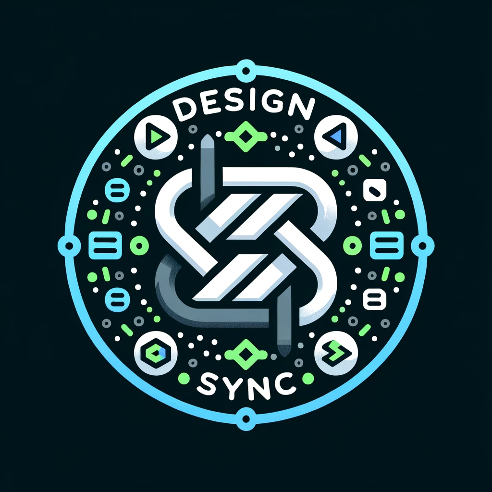

<p align="center">
 
</p>
<h1 align="center">DesignSync</h1>
<h4 align="center">Set of tools to help you sync your design tokens across platforms.</h4>

## Overview

DesignSync processes [W3C Design Token Format Module](https://design-tokens.github.io/community-group/format/) (DTFM) compliant tokens and transforms them into platform-specific output formats via a plugin system.

## Packages

### Core

| Package | Description |
|---------|-------------|
| [@design-sync/cli](./apps/cli) | Command-line interface |
| [@design-sync/manager](./packages/manager) | Plugin orchestration, config resolution, file writing |
| [@design-sync/w3c-dtfm](./packages/w3c-dtfm) | Token processor, query API, color utilities |
| [@design-sync/utils](./packages/utils) | Shared utilities |
| [@design-sync/rpc](./packages/rpc) | JSON-RPC 2.0 over postMessage |
| [@design-sync/storage](./packages/storage) | Remote storage providers (GitHub, GitLab, Bitbucket, Azure DevOps) |

### Output Plugins

| Package | Target |
|---------|--------|
| [@design-sync/css-plugin](./packages/css-plugin) | CSS custom properties |
| [@design-sync/json-plugin](./packages/json-plugin) | JSON |
| [@design-sync/vanilla-extract-plugin](./packages/vanilla-extract-plugin) | vanilla-extract |
| [@design-sync/styled-components-plugin](./packages/styled-components-plugin) | styled-components |
| [@design-sync/emotion-plugin](./packages/emotion-plugin) | Emotion |
| [@design-sync/tailwind-plugin](./packages/tailwind-plugin) | Tailwind CSS |
| [@design-sync/panda-plugin](./packages/panda-plugin) | Panda CSS |
| [@design-sync/unocss-plugin](./packages/unocss-plugin) | UnoCSS |
| [@design-sync/docs-plugin](./packages/docs-plugin) | Documentation (Markdown/HTML) |
| [@design-sync/assets-plugin](./packages/assets-plugin) | SVG sprites, icon components |
| [@design-sync/react-native-plugin](./packages/react-native-plugin) | React Native |
| [@design-sync/tamagui-plugin](./packages/tamagui-plugin) | Tamagui |
| [@design-sync/compose-plugin](./packages/compose-plugin) | Jetpack Compose (Kotlin) |
| [@design-sync/flutter-plugin](./packages/flutter-plugin) | Flutter (Dart) |
| [@design-sync/swiftui-plugin](./packages/swiftui-plugin) | SwiftUI (Swift) |

### UI

| Package | Description |
|---------|-------------|
| [@design-sync/figma-plugin](./apps/figma-plugin) | Figma plugin (Solid.js + vanilla-extract) |
| [@design-sync/design-tokens](./packages/design-tokens) | Theme contracts and platform themes |
| [@design-sync/uikit](./packages/uikit) | Shared UI components (Solid.js + Kobalte) |
| [@design-sync/figma-icons](./packages/icons) | Figma icon components |

## Quick Start

### Configuration

Create a `design-sync.config.ts` in your project:

```typescript
import { cssPlugin } from '@design-sync/css-plugin';
import { jsonPlugin } from '@design-sync/json-plugin';

export default {
  uri: 'gh:owner/repo/path#branch',
  out: './tokens',
  plugins: [cssPlugin(), jsonPlugin()],
  requiredModes: ['dark', 'light'],
  defaultMode: 'default',
};
```

### Sync tokens

```bash
npx design-sync sync
```

## Development

Requires **Node.js >= 22** and **Bun** as package manager.

```bash
# Install dependencies
bun install

# Build all packages
bun run build

# Lint all packages
bun run lint

# Type check all packages
bun run test:types

# Run all tests
bun run test

# Create a changeset for versioning
bun run changeset
```

### Single package

```bash
cd packages/css-plugin
bun run build
bun run test
```

## Publishing

GitHub Actions manages versioning and publishing via [Changesets](https://github.com/changesets/changesets). When changeset commits are merged to `main`, a release PR is created automatically. Merging the release PR publishes updated packages to npm.

## License

MIT
